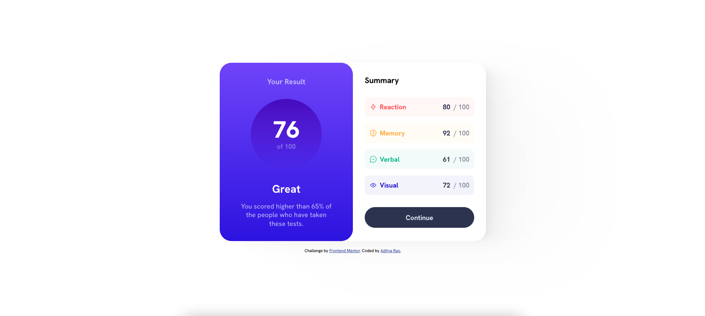

# Frontend Mentor - Results summary component solution

This is a solution to the [Results summary component challenge on Frontend Mentor](https://www.frontendmentor.io/challenges/results-summary-component-CE_K6s0maV). Frontend Mentor challenges help you improve your coding skills by building realistic projects.

## Table of contents

- [Overview](#overview)
  - [The challenge](#the-challenge)
  - [Screenshot](#screenshot)
  - [Links](#links)
- [My process](#my-process)
  - [Built with](#built-with)
  - [What I learned](#what-i-learned)
  - [Continued development](#continued-development)
- [Author](#author)

## Overview

### The challenge

Users should be able to:

- View the optimal layout for the interface depending on their device's screen size
- See hover and focus states for all interactive elements on the page
- **Bonus**: Use the local JSON data to dynamically populate the content

### Screenshot

### Links

- Solution URL: [Github repo](https://github.com/thisisadityarao/FM-results-summary-component)
- Live Site URL: [Live site](https://thisisadityarao.github.io/FM-results-summary-component/)

## My process

### Built with

- Semantic HTML5 markup
- CSS custom properties
- Flexbox
- Mobile-first workflow

### What I learned

It took me some time to get this one right. Getting the markup right was a challenge, since this component has a lot of atomic elements with their own styles. I made it more complex by trying to achieve the responsive layout for the component without using media queries. It was a challenge. I ended up using media queries for spacing and font-size.

### Continued development

I will start my next project with a proper font-size and spacing scale set up as css variables. It makes the stylesheet more managable and easy to navigate.

## Author

- Website - [Aditya Rao](https://adityarao.netlify.app/)
- Frontend Mentor - [@thisisadityarao](https://www.frontendmentor.io/profile/thisisadityarao)
- Twitter - [@thisisadityarao](https://www.twitter.com/thisisadityarao)
